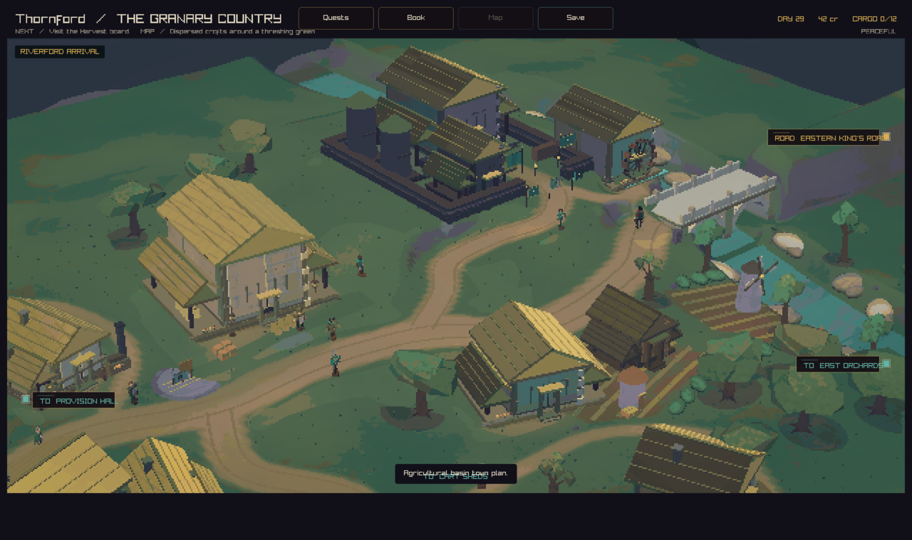
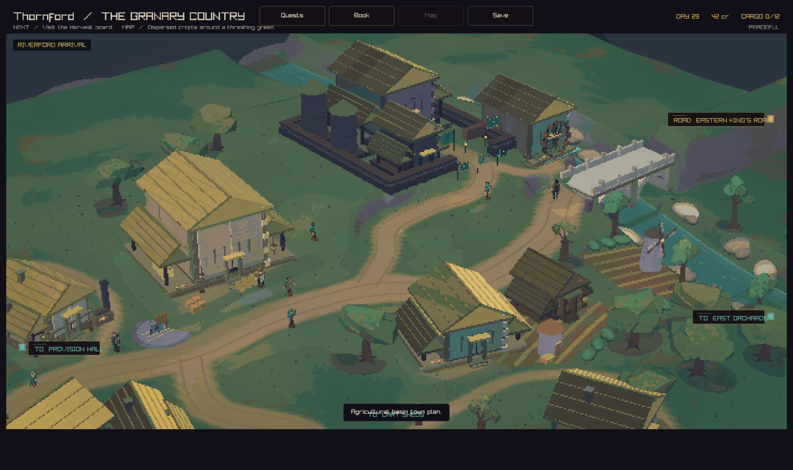

# Thornford river graphics

The river now has a dark centre and pale shallow edges. Seven painted bands
follow the existing river bends. Three small highlights per visible section
move gently with the scene clock. Their height follows the same water surface,
so the highlights stay on the river as the ground slopes.

The change adds at most 17 triangles per visible river section. Existing scene
culling and the bridge gap also apply to the highlights.

## Before and after

Both native captures use the same peaceful town, player position, and camera.
The before image comes from `556f44b7`; the after image includes this change.
The scene clock runs during capture, so animated roof light and foliage can vary.





## Reproduce

Build with the `play` preset, then run from the repository root:

```sh
out/build/play/crownless_carriage.app/Contents/MacOS/crownless_carriage \
  --capture-town-state 0 82 34 river.png peaceful
```

## Checks

The strict native build and native graphics regression suite pass. Visual review
covers the bridge view above and the river bend from player position 88, 45.

A 120-frame native street check measured 268 FPS with a 5.57 ms 95th-percentile
frame time and zero hitches on the local machine.
