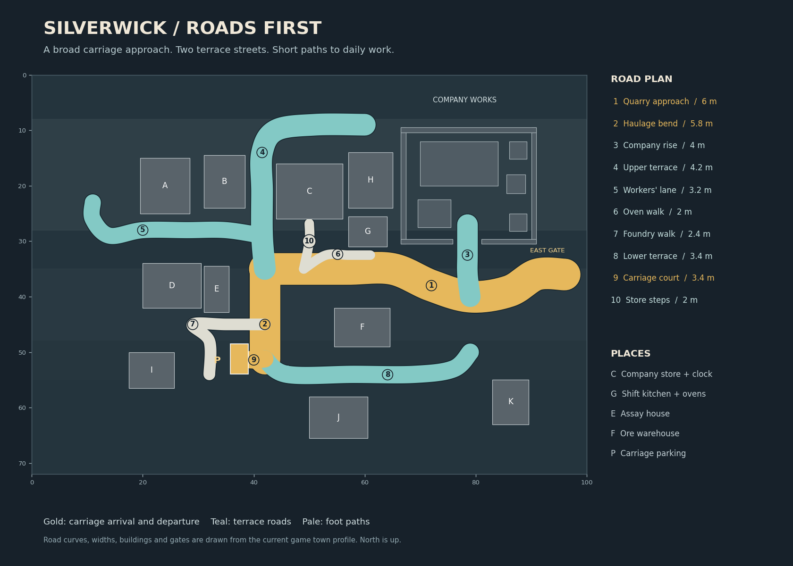
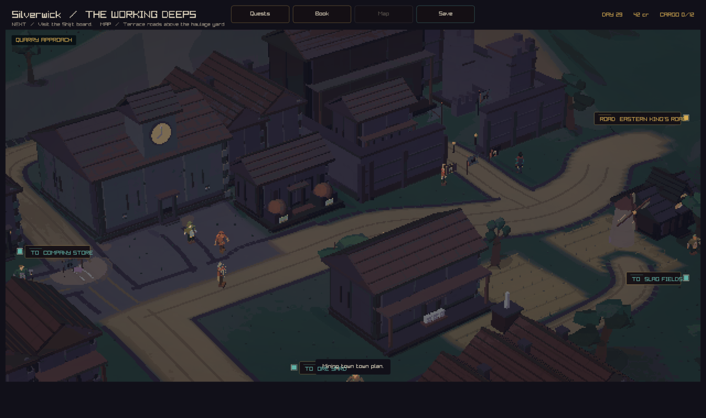
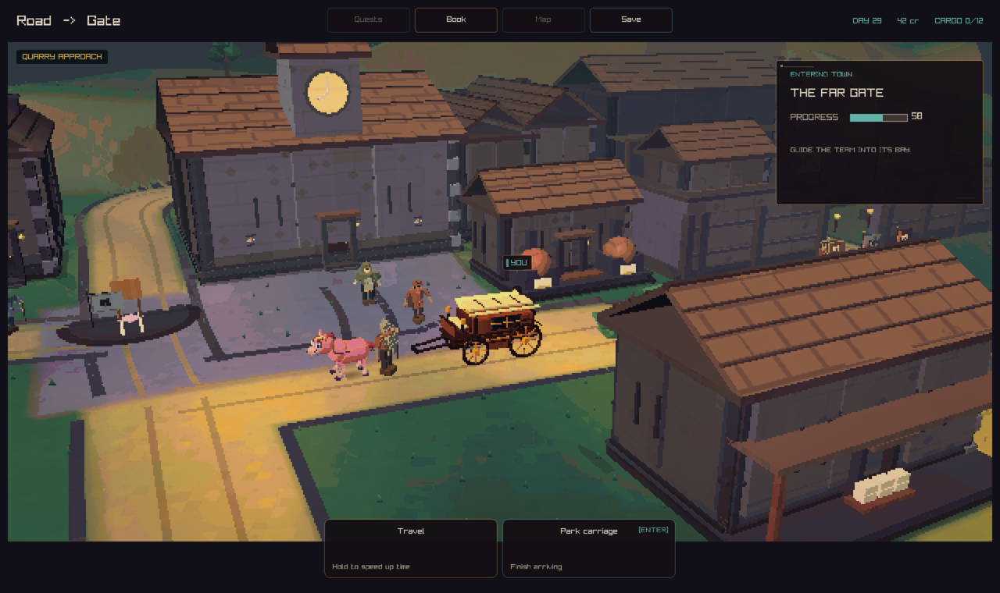

# Silverwick: roads first

Silverwick's roads now set the town plan. A six-metre quarry approach bends
from the east gate toward the clock square. The haulage bend leads to a level
carriage court. The upper terrace serves the worker rows. The lower terrace
passes the ore warehouse. Short walks reach the ovens, company store, and
foundry district. The company rise enters the works through its south gate.



The plan is drawn from the game's road curves, widths, building footprints,
and compound walls. [Open the full vector plan](roads.svg).

## Ground and movement

The streets use the same curves for their surface, slate edging, and carriage
path. The ground forms three working shelves, with gentle slopes between them.
The carriage court is level. A graded ramp joins the company gate to the
approach road. Trees stand back from the east approach.

The primary carriage route is gold on the plan. It starts at the east gate,
passes the square, and turns into the haulage yard. Departure reverses that
same path. The narrow pale paths serve people on foot.





## Buildings

The clock hall, worker homes, covered workshops, and public ovens establish
the first building shapes. Bread, iron, and tool props follow stored goods.
Fire damage and repair scaffolds follow town state.

The next layout pass can arrange more front doors along the terrace streets,
shape the retaining walls, and give the upper mine its timber headframe.

## Checks

The road test walks all nine public lanes in two terrain seeds. It checks
stone footstep surfaces, carriage endpoints, reverse departure, carriage
clearance, and a maximum arrival grade of 16 percent. The occupied parking
bay is covered by the existing arrival and departure tests. The existing
gate approach check requires a maximum grade of 14 percent.

Strict native build passed. The full suite passed 191 of 192 checks. The
remaining collision check passed after the gate ramp was extended. The final
road test also passed. Native graphics checks passed before the final ramp
refinements. The game captures show the tested road layout.

## Capture recipe

Build with the `play` preset. Run the native client from the worktree root:

```sh
--capture-town-state 3 82 34 arrival.png peaceful
--capture-town-arrival 3 0.58 carriage.png
```

The selected captures and road plan fit the project's review artifact budget.
