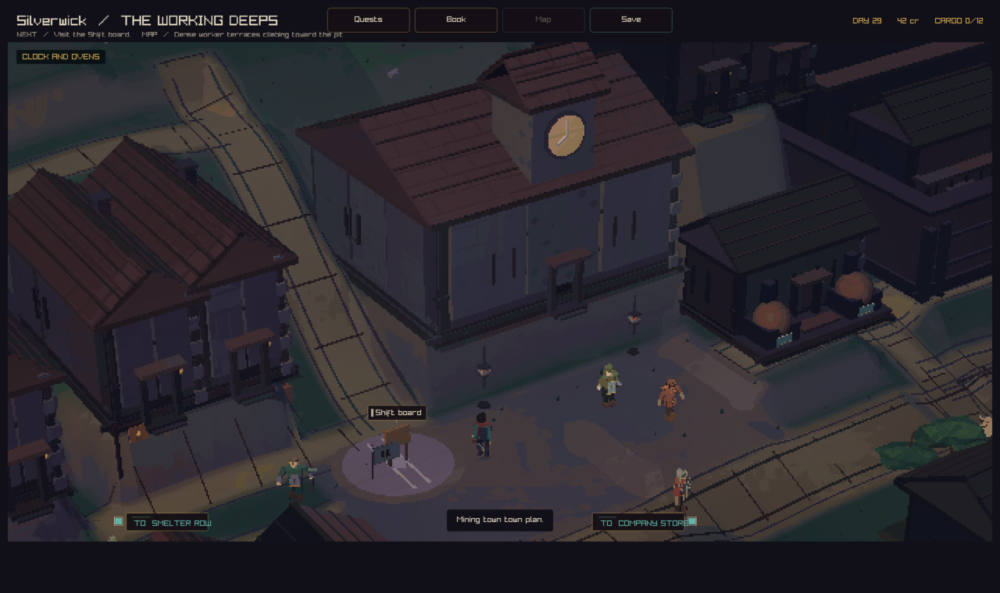
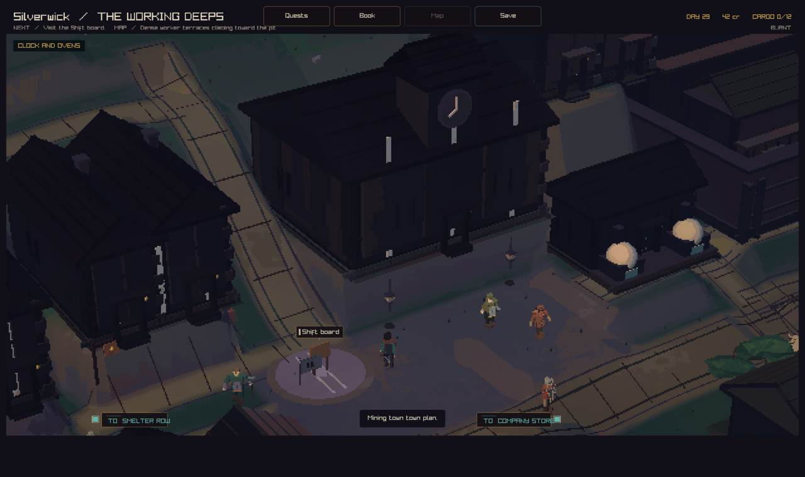
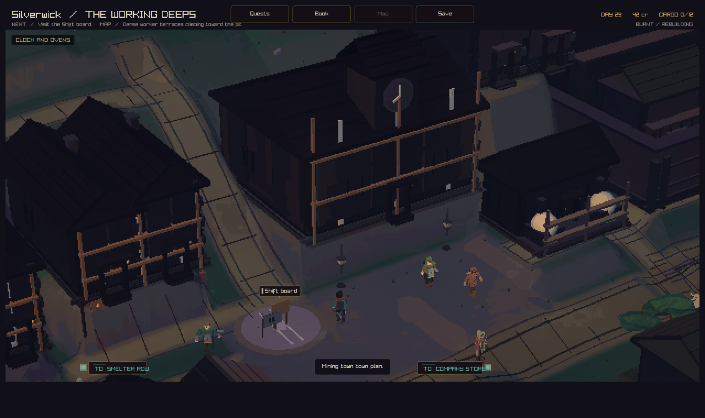
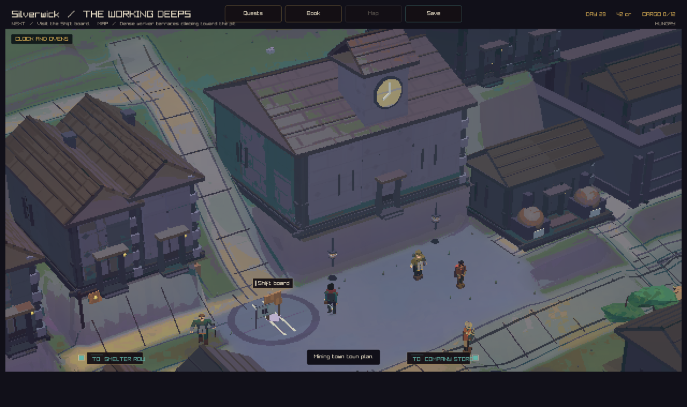
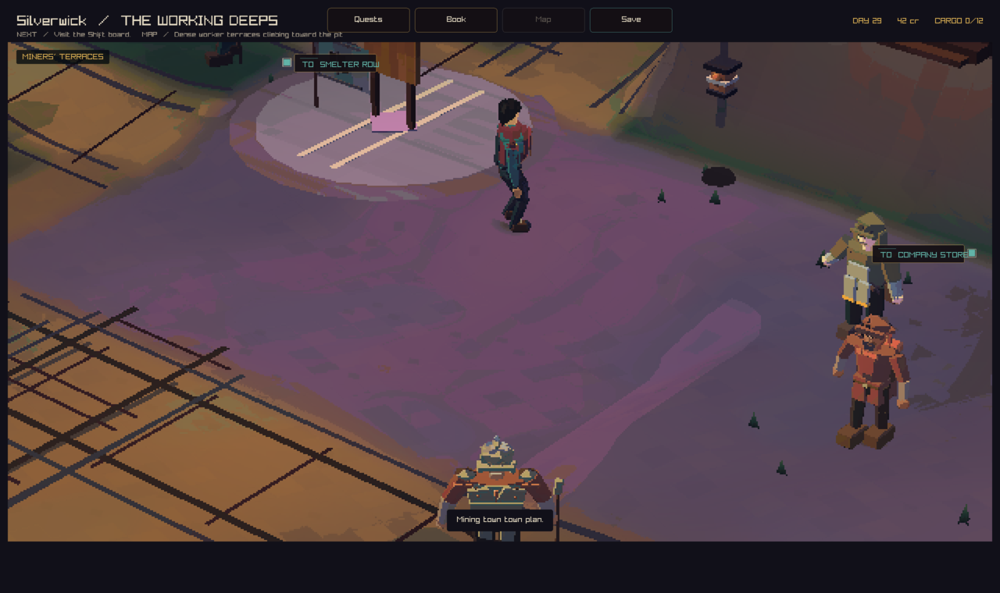

# Silverwick: clock and ovens

This first redesign pass gives Silverwick a clear town centre. The company
store carries a clock stopped at eight. Two public ovens stand beside the
shift kitchen. Narrow homes share walls and carry separate chimneys. Lower
workshops have covered bays. Cool stone and rust roofs tie the town together.

Thornford's river, granaries, and working yards make its purpose visible.
Gloamgate's round market gathers its lanes and trade courts. Silverwick builds
on that approach with a clock hall and kitchen for the workers below the mine.

## Game views

The square view includes the clock, kitchen, shift board, and worker homes.
The arrival view shows the hall below the company works.




## Town life

Bread on the kitchen shelf follows bread stock. Iron bars and tool crates
follow their town stocks. Each item represents four units, up to six items.
The ovens show warmth when wheat and wood are available and the kitchen is
intact. This is a supply cue. Production remains governed by the simulation.

Saved fire damage darkens buildings in a stable order. Repair scaffolds appear
on damaged buildings while the town is rebuilding. The clock keeps its time
through fire and repairs.







## Before

Main at `ccde4377`, with the same square capture position:



## Checks

- Strict native build passed.
- The full local run passed 188 of 192 checks. Three server checks passed with
  local server access. The place profile check passed after its height range
  was adjusted for Silverwick's lower workshops.
- All eight focused checks passed after the final camera and scaffold changes:
  place profiles, adventure input, arrival parking, departure, skin rotation,
  walking collision, character collision, and terrain.
- Native graphics checks passed before the final framing and scaffold changes.
- Final native captures cover the square, arrival, carriage, fire damage,
  repair work, and food shortage.

## Next design pass

Shape three slate terraces around a climbing carriage road. Add foot stairs
between them. Give the mine company a timber headframe and exposed rock seams.
Use the same town plan for ground shape, walking, carriage travel, and camera
views. Review a full arrival, store visit, kitchen walk, and departure.

## Capture recipe

Build with the `play` preset. Run the native client from the worktree root:

```sh
--capture-town-state 3 44.25 28.85 square.png peaceful
--capture-town-state 3 82 34 arrival.png peaceful
--capture-town-arrival 3 0.58 carriage.png
--capture-town-state 3 44.25 28.85 burnt.png burnt
--capture-town-state 3 44.25 28.85 rebuilding.png rebuilding
--capture-town-state 3 44.25 28.85 hungry.png hungry
```
