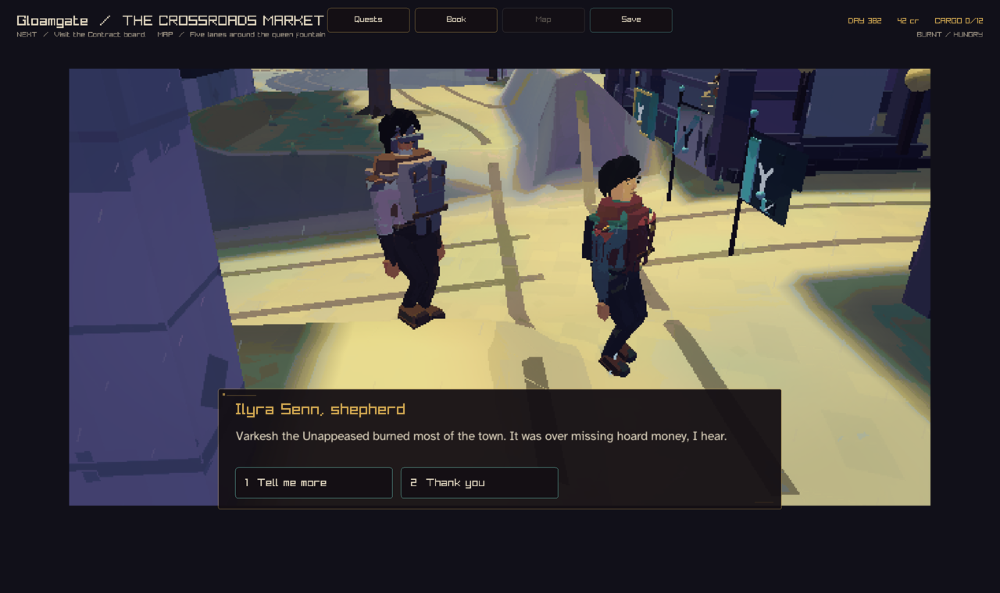
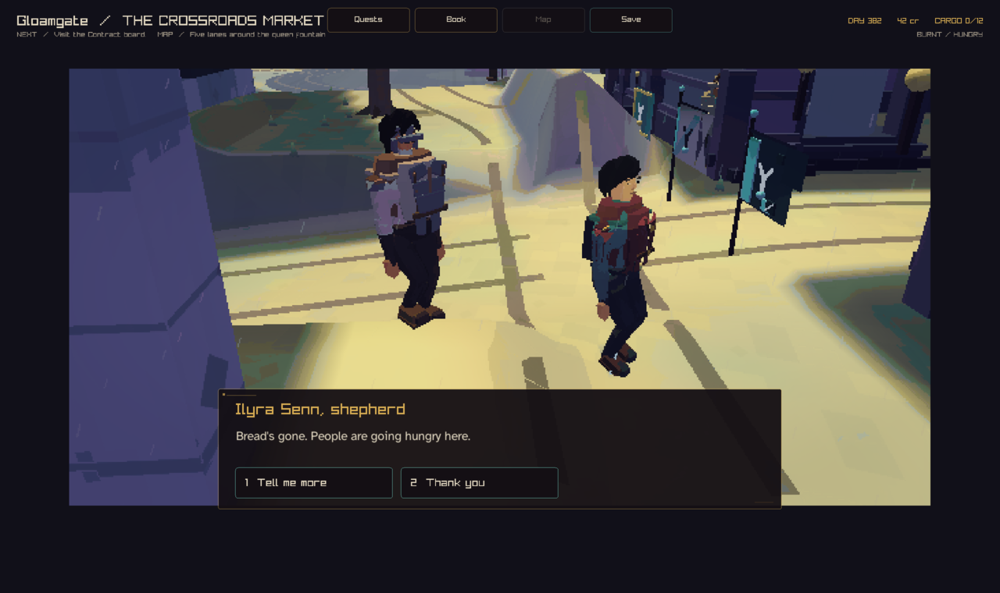
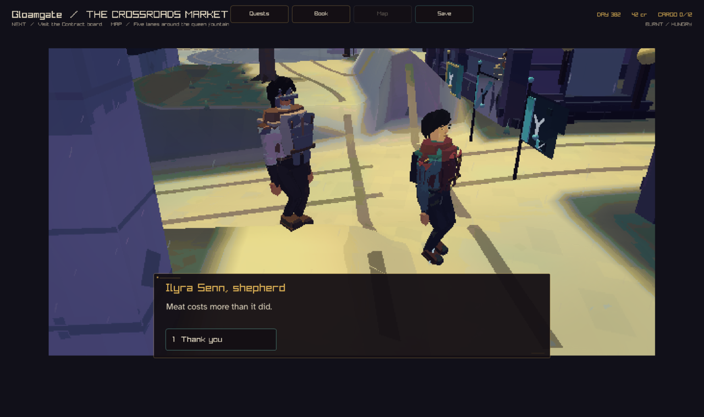

# The Return, milestone 3: the gate voice

Seed 4. The company leaves Thornford, rides to Silverwick, waits 365 days, and
rides back. At Gloamgate (index 1) a resident meets the company and says what
changed. The speaker (left, in the brown shawl) stands a few steps ahead of
the player and faces them. The conversation camera frames the two of them.

| Frame | Line | How the resident knows |
| --- | --- | --- |
|  | "Varkesh the Unappeased burned most of the town. It was over missing hoard money, I hear." | The event comes from their telling of the DRAGON FIRE story (93% sure) and from how much of the town burned now. The cause comes from the same telling. |
|  | "Bread's gone. People are going hungry here." | They can see it: the bread stall is empty and hunger is 58. Their SHORTAGE story only says that there is hunger here, so it adds nothing. It is still marked as told. |
|  | "Meat costs more than it did." | Seen. The last change offers only "Thank you". |

Lines follow the gate order: what happened, then why, then who said so. A
resident says "the town" or "here", not the town's name. With a named source
and middling confidence the fire line reads: "Varkesh burned most of the
town. Folk say it was over missing hoard money — I heard it from Thora at the
inn."

The fire and hunger stories are marked as told when they are spoken, so the
digest ranks them lower. The lost market is not spoken, because the same
DRAGON FIRE story explains it and the company has now been told.

## Capture recipe

```sh
crownless_carriage --capture-gate-voice 4 365 1 gate-fire.png
crownless_carriage --capture-gate-voice 4 365 1 gate-hunger.png 1
crownless_carriage --capture-gate-voice 4 365 1 gate-last.png 15
```

The arguments are SEED DAYS TOWN FRAME [TURNS]. TURNS is how many times
"Tell me more" is chosen. The capture waits 120 frames so the conversation
camera settles. The text tool prints every line, with each clause's part
(event, cause, source) and evidence:

```sh
crownless_return_digest --seed 4 --days 365 --voice
```
