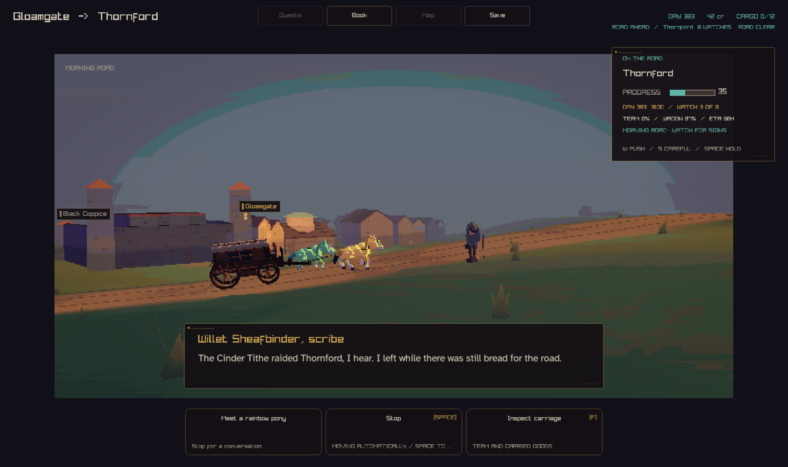
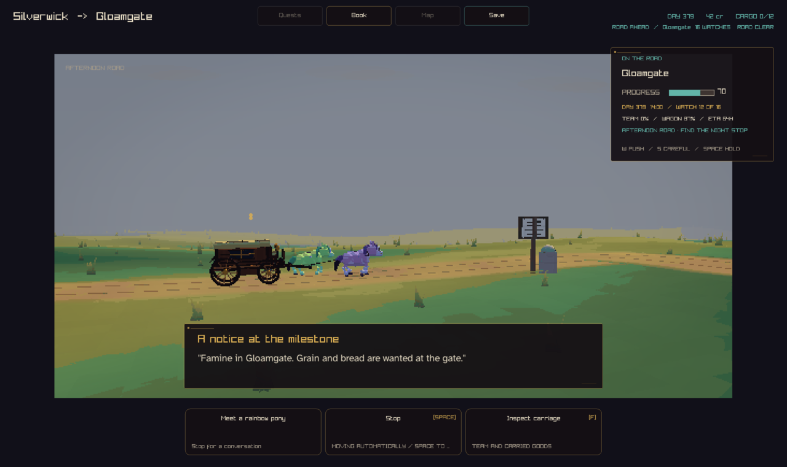
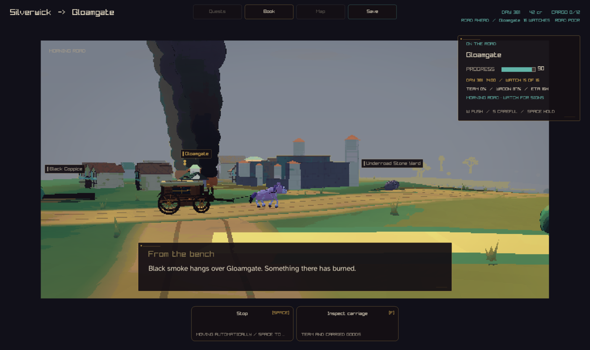
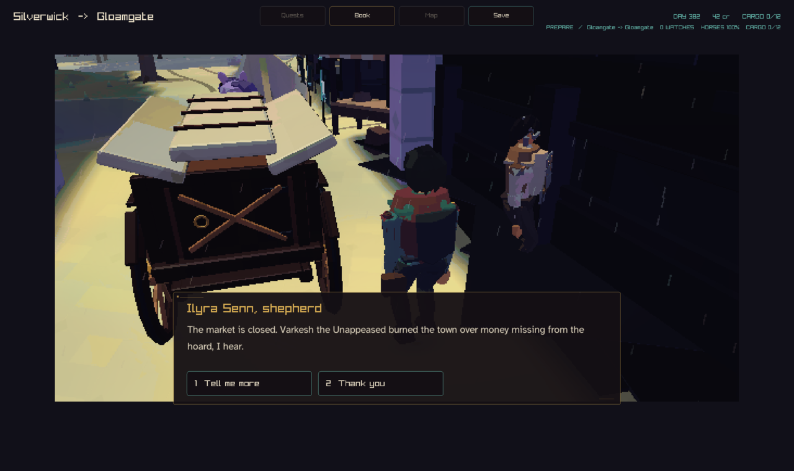

# The Return, milestone 4: news on the road

The company leaves Thornford, rides to Silverwick, waits, and rides back. On
the road back it meets news about towns it has seen before. Each frame is the
storybook travel view at the moment the news is met.

| Frame | Seed, days | What the company meets |
| --- | --- | --- |
|  | 2, 365 | A traveller on the road from Thornford stops on the verge ahead. *Willet Sheafbinder, scribe:* "The Cinder Tithe raided Thornford, I hear. I left while there was still bread for the road." Their own telling of the raid story (93% sure), hedged, then a word about their own road. The raid is marked told. |
|  | 4, 365 | A milestone with a notice, at 70% of the leg to Gloamgate. *A notice at the milestone:* "Famine in Gloamgate. Grain and bread are wanted at the gate." The hunger is marked read, at full confidence. |
|  | 4, 365 | Near Gloamgate, a day after the dragon burned it: the town's smoke columns rise over it. *From the bench:* "Black smoke hangs over Gloamgate. Something there has burned." The fire is marked witnessed. |
|  | 4, 365 | The payoff. At the gate the resident no longer leads with the fire, which the company saw, or the famine, which it read. *Ilyra Senn, shepherd:* "The market is closed. Varkesh the Unappeased burned the town over money missing from the hoard, I hear." Compare `the-return-gate-voice-2026-09-25/gate-fire.png`, the same return without road news. |

The arrival scene still stages news met on the road (the smoke, the hungry
crowd), because a notice is not the town and smoke on the horizon is not the
burned street. Only the words move on.

## Capture recipe

```sh
crownless_carriage --capture-road-news 2 365 told road-traveller.png
crownless_carriage --capture-road-news 4 365 read road-notice.png
crownless_carriage --capture-road-news 4 365 witnessed road-smoke.png
crownless_carriage --capture-gate-voice 4 365 1 gate-after-road.png
```

`--capture-road-news SEED DAYS CHANNEL FRAME` rides the same trip as
`--capture-return` and stops on the road back at the first news of CHANNEL.
Before the capture it draws the travel view twice and checks that the world
did not change. The text tool prints each piece of news when it is met:

```sh
crownless_return_digest --seed 4 --days 365 --voice
```
