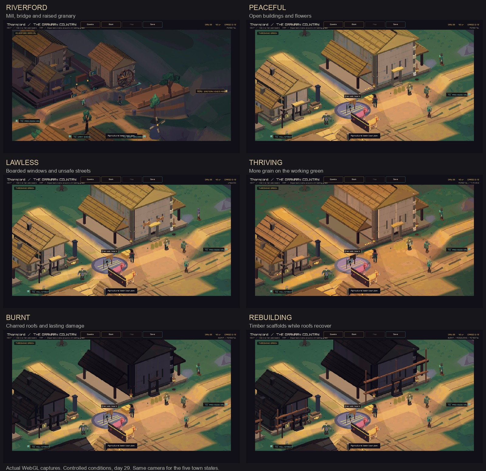

# Thornford: a river village that remembers

Thornford's first environment pass gives the arrival view more room, puts a
watermill beside the crossing, raises the granary on stone feet, lowers its
boundary walls, and spreads the crofts around an earth threshing green. Straw
roofs, pale plaster, fieldstone, and soft hills give the farming town its own
shape. The three-crown milestone marks the bridge.




Full captures: [peaceful](peaceful.png), [lawless](lawless.png),
[thriving](thriving.png), [burnt](burnt.png), [rebuilding](rebuilding.png).

## Town evolution in this build

The town has several conditions at once. Its identity stays Thornford as its
fortunes change. A wealthy town can be lawless. A poor town can be peaceful.
Builders can work among burnt buildings while markets recover.

| Condition | Current rule | Thornford's visible response |
| --- | --- | --- |
| Burnt | Saved fire damage above zero | Charred walls and roofs on a stable set of buildings |
| Rebuilding | Fire repair supplies, food and security are ready, or a service project is under way | Timber scaffolding at damaged buildings and the provision hall |
| Lawless | Security at 25 or below | Boarded windows; existing low-security street characters |
| Peaceful | Security at least 60, local war burden below 20, monster pressure below 30 | Flowers beside open buildings |
| Thriving | Prosperity at least 70 and hunger below 20 | More grain sacks on the working green; existing richer ground colours |
| Hungry | Hunger at least 40 | Sparse grain supplies; existing hunger response in fields and crowds |
| Abandoned | Population reaches zero | The simulation's existing abandoned-settlement state; burnt history remains |

The town header lists the current conditions. These labels come from saved
simulation values. Food, wealth, security, services, and population already
change through production, trade, hunger, threats, politics, and construction.

### Fire and recovery

A dragon retaliation adds 60 fire damage, capped at 100, and records the day.
The existing attack also destroys a third of the stock, removes a service,
reduces population, wealth and security, and damages nearby roads.

Fire repairs begin after at least seven days. At the weekly town update,
builders repair ten damage if all these requirements are met:

- The town has residents.
- Hunger is below 40 and security is at least 30.
- Its stores hold 2 Wood, 1 Stone, and 1 Tools.

Each repair consumes those goods and creates a local masonry event. Sixty
damage takes six repair weeks with steady supplies, plus any wait for the
weekly update. Hunger, insecurity, or missing materials can extend the work.
Later attacks add damage to the same town.

As damage falls, the same buildings recover in a stable order. Fresh timber
patches remain after repair. The last fire date stays in the save, so the town
keeps a trace of the event after its buildings recover. Service restoration
uses the existing service project system: materials, treasury funds, and seven
days of construction.

The simulation saves fire damage and the last fire day in schema 45. Schema 44
campaigns load with a clean fire history. Future fires and repairs then use the
new rules. Old snapshots retain their original simulation rules during journal
replay.

### What the player can change

Food deliveries support recovery from hunger. Wood, stone, and tools supply
repairs. Safe roads help traders reach the town. Resolving local threats helps
security. Service projects restore useful places and can improve the economy.
The existing dragon theft and repayment choices can cause or prevent a burn.

One possible story is: a dragon burns the village; lost stores increase hunger;
builders wait; food arrives; the road becomes safer; tools and timber reach the
market; roofs recover over several visits; the service hall reopens. Each step
has a cause in the simulation and a visible place in Thornford.

## The next layers

1. **Named building plots.** Give the mill, granary, inn, crofts, and workshops
   their own damage and construction records. The current saved damage is a
   town-wide measure; plot records would let a specific event burn a specific
   place and reopen its own service.
2. **Growth around the green.** Add households, sheds, gardens, and working
   yards to authored expansion plots after sustained population and wealth
   growth. Keep the river, bridge, green, and service approaches as familiar
   anchors. New collision shapes and walking routes should arrive with each
   completed building.
3. **Visible work and local stories.** Connect builders and residents to those
   plots. Let gossip name the fire, the ruined service, and the people who
   supplied its recovery. Use the existing event history and character memory.
4. **Long-lived landscape change.** Show neglected fields, repaired hedges,
   coppiced woodlots, and orchard growth through authored stages. Require
   several weeks of sustained change before large scenery swaps.
5. **More fire causes and weather.** Add building-specific outcomes for raids,
   accidents, and weather. Use each town's materials to shape its damage and
   repair style. Thornford replaces thatch and timber; Silverwick repairs slate
   roofs and retaining walls.

This gives each visit a clear story: familiar geography, changed daily life,
and visible traces of past events.

## Review and checks

The local suite passed all 85 checks. The two speech tests passed with the
localhost access their test servers require. Focused checks cover mixed town
conditions, repair costs, save continuity, incomplete recovery rows, schema 44
loading, dragon damage, town road clearance, collision space, and hilly terrain.
The native client and WebAssembly client both build with strict warnings.

State review captures use controlled simulation values at day 29. They show
the WebAssembly renderer with staged conditions. All five condition views use
the same camera. The river view uses the peaceful state. The comparison sheet
places the original captures beside one another with labels. The native client
built successfully; this session used WebGL for visual review because native
window creation failed.

Regular town captures show the simulation's ordinary state.

```sh
out/build/play/crownless_carriage.app/Contents/MacOS/crownless_carriage --capture-town 0 82 34 river.png
out/build/play/crownless_carriage.app/Contents/MacOS/crownless_carriage --capture-town-state 0 44.25 28.85 thriving.png thriving
out/build/play/crownless_carriage.app/Contents/MacOS/crownless_carriage --capture-town-state 0 44.25 28.85 burnt.png burnt
```

The state command also accepts `peaceful`, `lawless`, and `rebuilding`.
