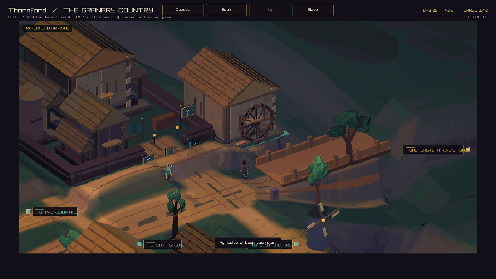
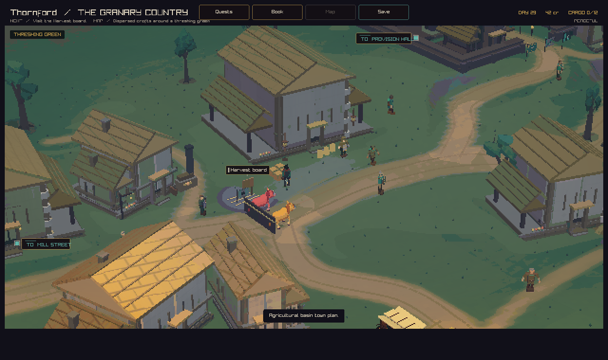
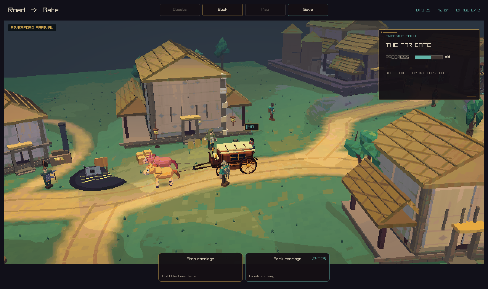
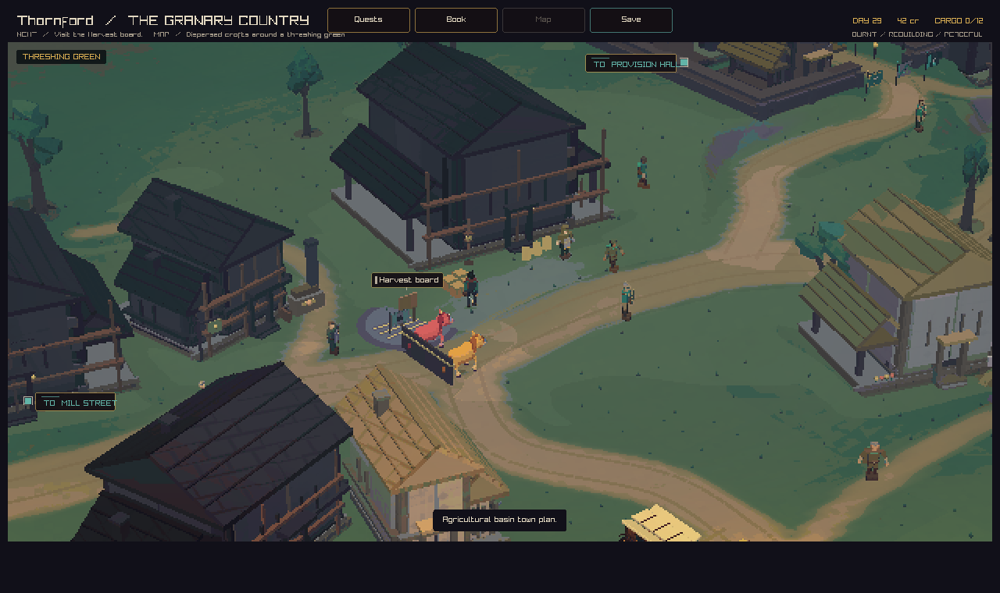

# Thornford: roads, river, and plots

Thornford grows around its river crossing. The ford road bends toward the green.
Smaller lanes serve the cart yard, granary, mill, crofts, and orchards. Nine
authored curves provide the road surface, ground grading, and wheel tracks.
The granary road has a steady climb to its gate.
Arriving carriages follow the ford road into Cartwright lane and the cart yard.
Departing carriages use those same road samples in reverse.

Houses turn toward their lanes. Their foundations, collision boxes, and camera
cutaways use the same rotation. Crop parcels have their own angles and leave
space for the lanes, riverbanks, and buildings. The bridge has two stone arches,
with the riverbed visible below the deck.

## Before

The arrival view from PR #361 used the earlier close camera and dusk light.



## After

The arrival camera shows the bridge, hill granary, and road into the village in
daylight. These are captures from the game renderer.






The same plots carry the town's damage and repair state.



## Capture recipe

Build with the `play` or `web` CMake preset. The game's capture arguments are:

```sh
--capture-town-state 0 82 34 arrival.png peaceful
--capture-town-state 0 44.25 28.85 green.png peaceful
--capture-town-state 0 44.25 28.85 rebuilding.png rebuilding
--capture-town-arrival 0 0.58 carriage.png
```

The final PNG files came from the native game's capture output. The browser
review also used these arguments with the WebAssembly build.

## Checks

The terrain tests walk the three main lanes and check their ground surface,
slope, and clearance. Movement tests sample the curved granary road against the
14% cart grade limit. Collision tests check angled buildings in streamed towns.
The full native suite also covers the other town plans, town conditions, and
camera transitions.

Local validation: all 88 native tests pass. Native and WebAssembly builds pass.
Camera framing time grows with the distance travelled. The existing camera
test exercises six towns at 30, 60, and 144 frames per second with two terrain seeds.
The carriage path test checks both directions, the gate and parking endpoints,
and the road surface along the route.
