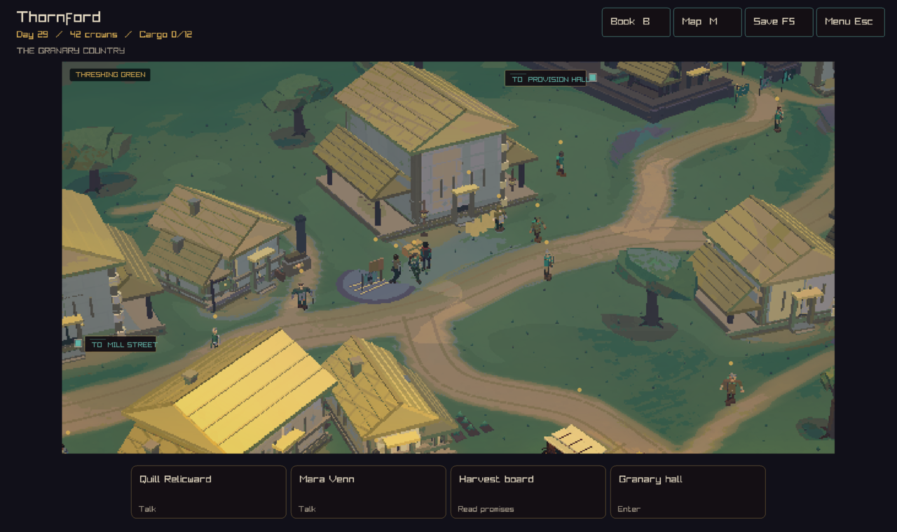
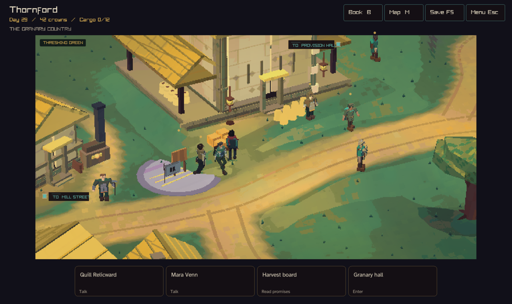
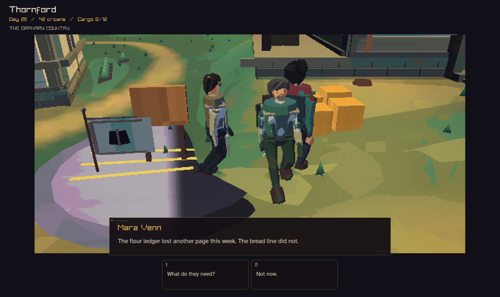
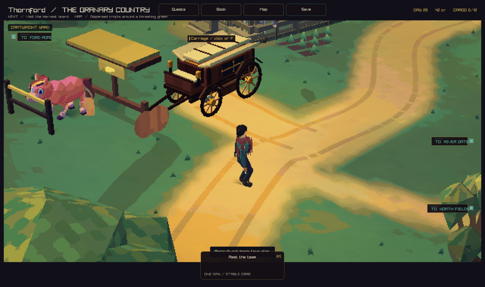

# Thornford journey graphics

The threshing green now uses a closer walking view. The carriage yard shows the
player, pony, and carriage together. Farm daylight has warm highlights and cool
shadows. Interior fill light lifts the granary shelves and counter. The model
NPC contact shadow follows the figure's height.

Conversation framing leaves room above the dialogue. The shared clear-view
camera search accounts for the space between its two subjects. New tests cover
head visibility and separation from eight directions. Existing camera tests
cover smooth movement, interruptions, town routes, and arrival handoffs.

Adventure body text uses Atkinson Hyperlegible Regular. Conversation text and
action labels are larger. Wrapped text uses the same font for measurement and
drawing. Titles retain the display typeface. The font ships in native and web
assets with its SIL Open Font License.

## Walking to the granary

Before, from main at `d3e218ea`:



After:



## Talking in town



The UX conversation capture now supplies the witness position and identity,
matching the ordinary interaction path.

## Returning to the carriage



## Validation

- Strict native build passed.
- All 188 local tests passed before the final action-label and yard refinements.
- Focused input and camera checks cover the final refinements.
- Native GPU checks passed, including font loading, measurement, queued drawing,
  fallback after unloading, and conversation head visibility.
- Native views were reviewed at 1040, 1280, and 1920 pixels wide, including the
  larger text preference at 1040 pixels.
- The prepared browser font matches the source font byte for byte.

The existing adventure input test covers door approach, entry, the keeper's
trade action, purchase, exit, and carriage actions. The keeper uses the game's
trade flow. Town conversation is reviewed beside the harvest board.

## Capture recipe

Build with the `play` preset. Run from the worktree root:

```sh
out/build/play/crownless_carriage.app/Contents/MacOS/crownless_carriage --capture-ux 0 street.png
out/build/play/crownless_carriage.app/Contents/MacOS/crownless_carriage --capture-ux 1 granary.png
out/build/play/crownless_carriage.app/Contents/MacOS/crownless_carriage --capture-ux 2 talk.png
out/build/play/crownless_carriage.app/Contents/MacOS/crownless_carriage --capture-ux 3 keeper.png
out/build/play/crownless_carriage.app/Contents/MacOS/crownless_carriage --capture-town 0 42.4 55.2 yard.png
out/build/play/crownless_carriage.app/Contents/MacOS/crownless_carriage --capture-ux 2 small-talk.png 1040 2
out/build/play/crownless_carriage.app/Contents/MacOS/crownless_carriage --capture-ux 2 wide-talk.png 1920 0
```
