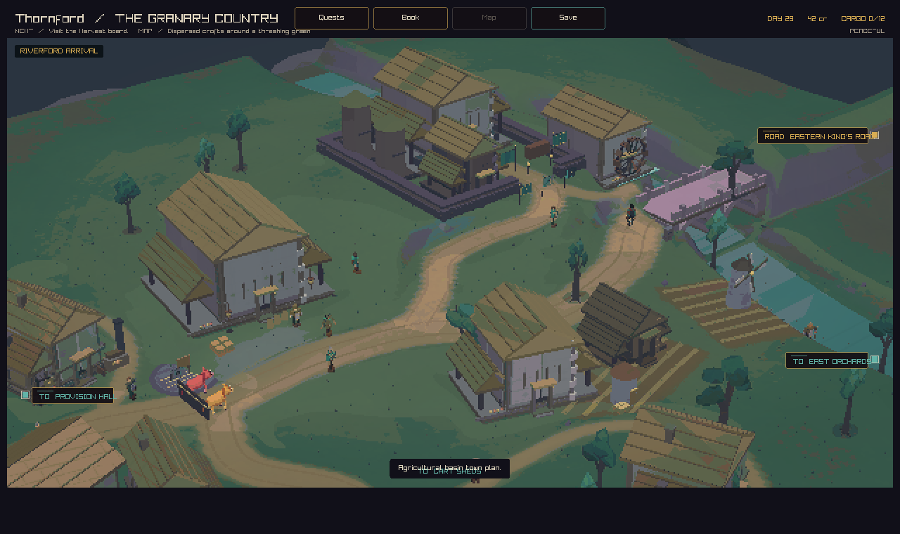
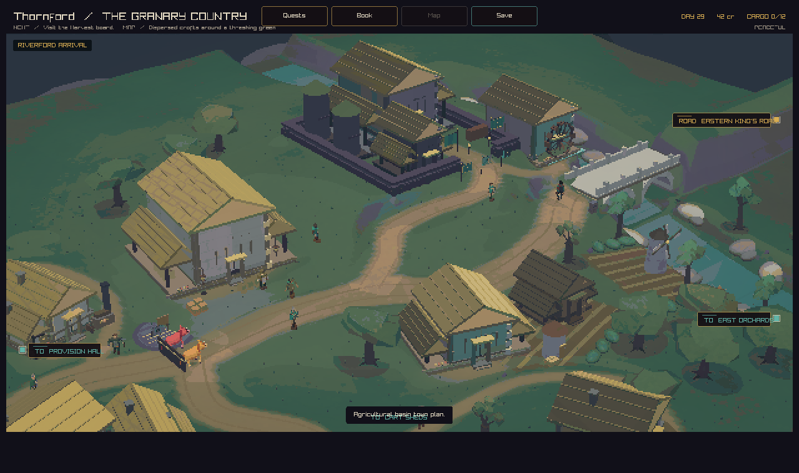
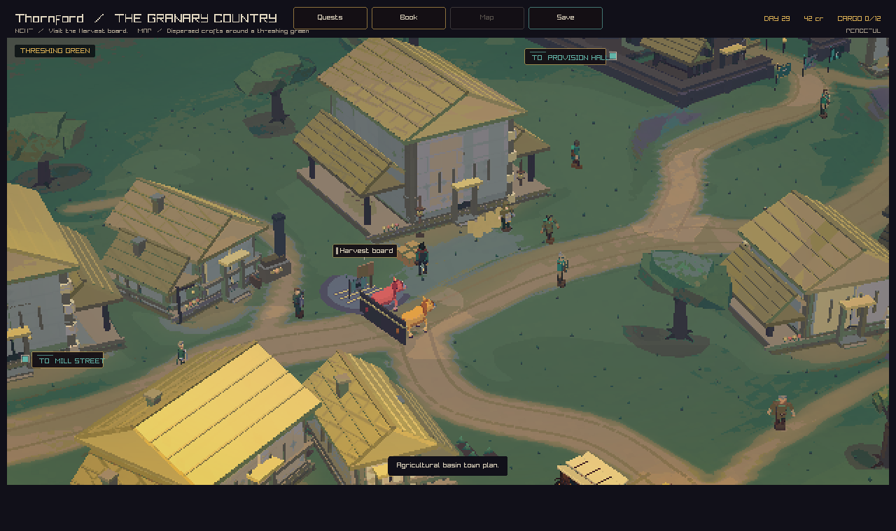
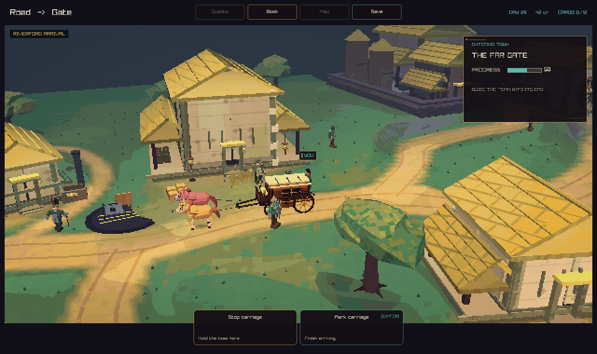
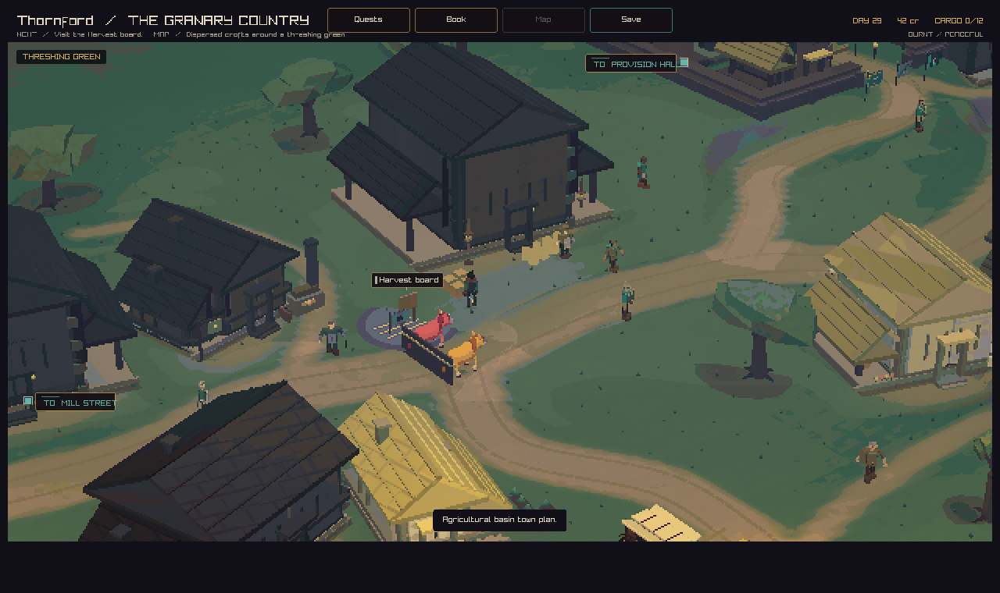
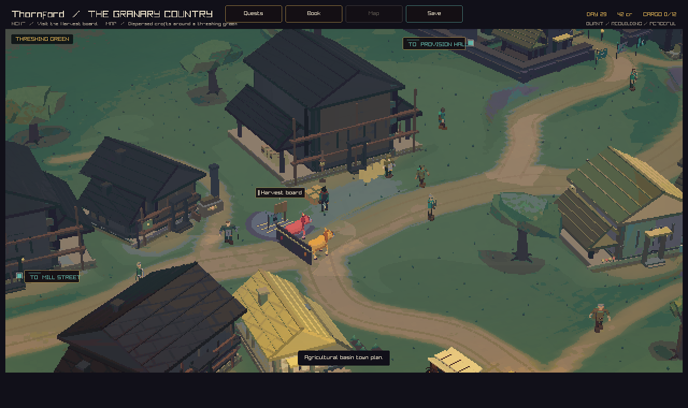

# Thornford: a working village

This pass gives Thornford a stronger shape around the road and river. Lower
cottages and cart sheds let the provision hall and hill granaries stand above
the village. Pale plaster, warm thatch, and a pale stone bridge share the game's
existing palette.

Broad orchard trees grow in groups and rows. Alders follow the riverbank.
Kitchen gardens sit beside cottages. Low hedges mark crop parcels, with wide
gaps at the curved lanes. Groups of rocks and small water highlights break up
the river edge. Worn ground links each front door to its yard.

The working bays show current wheat, wood, and tool stocks. Wheat sacks appear
at the barn, provision hall, mill, and harvest board. Wood stacks and tool crates
fill the cartwright's bays. Repair supplies appear beside the hall during
rebuilding. These are coarse views of town stocks: each prop stands for several
units. Burnt buildings show the existing fire damage and repair scaffolds.
Garden plants grow thinner as hunger rises.

## Arrival before

This is the arrival capture from merged PR #365.



## Arrival after

These are native game captures from this pass.







## Fire and repair





## Checks

The native build passes with strict warnings. All 88 native tests pass, including
curved road clearance, cart grades, carriage routes, building collision, camera
sightlines, and town conditions. The place profile test now accepts Thornford's
smaller cottage heights.

The tree plan is shared with camera sightline checks. Trees still use two cached
GPU meshes. Working stock props sit within existing building footprints. The
road layout, building footprints, simulation rules, and save data keep their
current behavior.

## Capture recipe

Build with the `play` CMake preset. Run the app from the worktree root with:

```sh
--capture-town-state 0 82 34 docs/reviews/thornford-polish-2026-09-05/arrival.png peaceful
--capture-town-state 0 44.25 28.85 docs/reviews/thornford-polish-2026-09-05/green.png peaceful
--capture-town-state 0 44.25 28.85 docs/reviews/thornford-polish-2026-09-05/burnt.png burnt
--capture-town-state 0 44.25 28.85 docs/reviews/thornford-polish-2026-09-05/rebuilding.png rebuilding
--capture-town-arrival 0 0.58 docs/reviews/thornford-polish-2026-09-05/carriage.png
```
