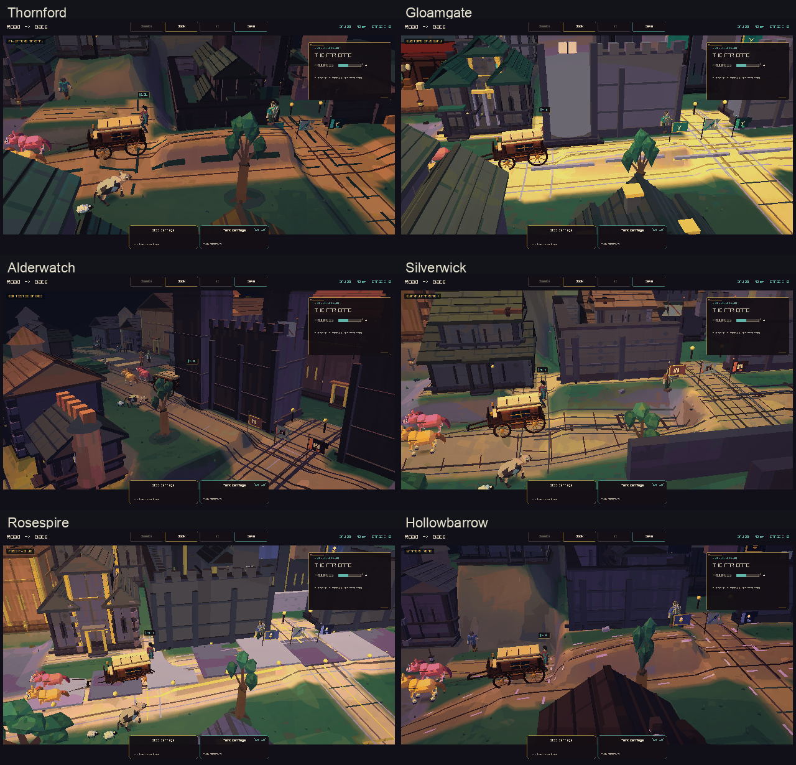
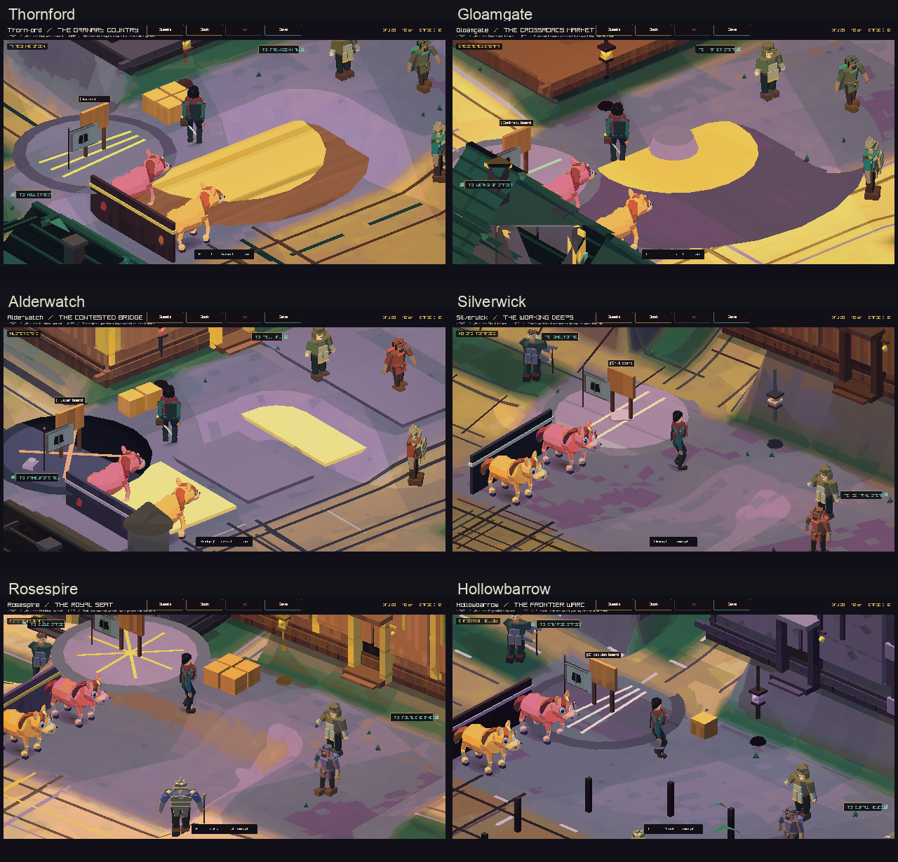
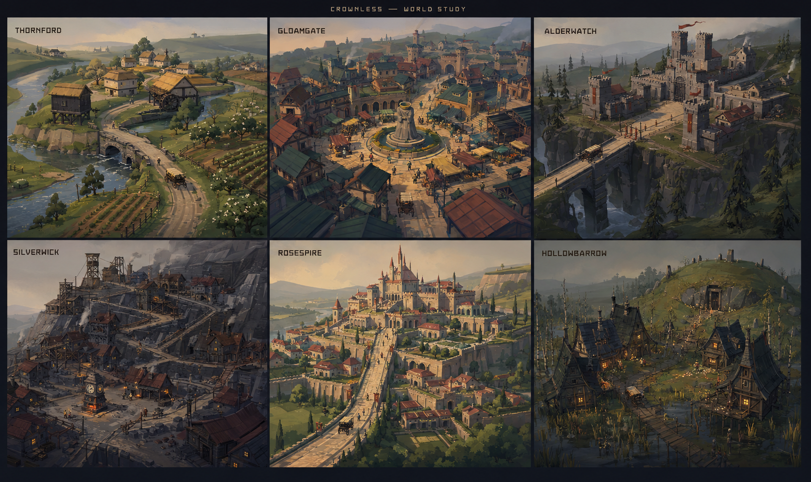

# A shared world, six memorable towns

Status: design proposal. Current game captures come first, followed by the
proposed art direction and map changes.

## The game today

These twelve images were captured from main `57c8324` on 5 September 2026.
Each town has a centre view and an arrival view at 45% of the arrival sequence.
The game UI is included. The overview sheets use half-size copies of the
original captures.





| Town | Original arrival | Original centre |
| --- | --- | --- |
| Thornford | [Arrival](current/town-0-arrival.png) | [Centre](current/town-0-center.png) |
| Gloamgate | [Arrival](current/town-1-arrival.png) | [Centre](current/town-1-center.png) |
| Alderwatch | [Arrival](current/town-2-arrival.png) | [Centre](current/town-2-center.png) |
| Silverwick | [Arrival](current/town-3-arrival.png) | [Centre](current/town-3-center.png) |
| Rosespire | [Arrival](current/town-4-arrival.png) | [Centre](current/town-4-center.png) |
| Hollowbarrow | [Arrival](current/town-5-arrival.png) | [Centre](current/town-5-center.png) |

The painted surfaces, warm lights, cool shadows, and angular trees already
belong together. Buildings have readable roofs, corner posts, doors, and lamps.
Thornford has a threshing platform. Gloamgate has a round market feature.
Alderwatch has the strongest gate silhouette. Silverwick and Hollowbarrow have
darker streets, while Rosespire has brighter paving and trim.

The main opportunity is composition. The arrival frames share large wall
surfaces, a similar road crossing, and similar building forms. The close views
give much of the frame to paving and the town board. The landscape and the
town's major landmark deserve a clearer place in each first view.

The data explains part of this repetition. All six `CcLocalPlaceProfile`
records use the same coordinates and sizes for their five carriage-road
rectangles. Each record has its own road names and surface type. Their building
positions also follow a similar arrangement. The map descriptions already
promise stronger shapes: a radial bazaar, a straight garrison, and climbing
worker terraces.

## Proposed direction

**A warm, worn storybook world shaped by work, travel, and old power.**

Each town should have a landform, a street shape, a roof silhouette, and a
landmark that people can remember. Local materials explain its colour.
Trade explains the shared objects found along the road.

The concept sheet below was made with the built-in image generation tool.
It proposes composition, mood, and material families. The game implementation
would express these views through broad shapes at its 630 by 320 scene size.
The generation brief is in [concept-prompt.md](concept-prompt.md).



## Shared visual rules

- Use broad painted light and shadow shapes. Put small surface marks around
  doors, steps, road edges, and places where people work.
- Build from timber, plaster, local stone, roof tile, slate, and cloth. Give
  related pieces the same scale of grain, seams, wear, and edge highlights.
- Make a building's base follow the ground. Use stone footings, retaining
  walls, stairs, ramps, and planted edges to join buildings to slopes.
- Shape a road as a travelled surface: a broad middle, wheel wear, drainage,
  and soft shoulders. Let paving appear where the town can afford it.
- Group vegetation by use and habitat: orchards and hedges beside fields,
  alders near water, sparse wind-shaped trees above the ravine, reeds in the
  wet hollow, and tended gardens near the court.
- Keep one clear landmark in an arrival view. Let foreground roofs frame it.
  Place the carriage and its route in a clear area of the frame.
- Repeat a few marks across the realm: old crown milestones, merchant cloth,
  patched gates, road shrines, and familiar cart fittings. Show each town's
  way of using and repairing them.

## Six town designs

| Town | Land and street shape | Building family and colour | Remembered landmark |
| --- | --- | --- | --- |
| Thornford | River bend, soft hills, loose crofts around a working green | Low straw roofs, cream plaster, honey timber, mossy fieldstone | A raised granary and watermill above the ford |
| Gloamgate | Shallow basin, market ring, five lanes and covered courts | Narrow shop fronts, arcades, russet roofs, teal cloth, warm ochre | The headless queen fountain at the centre of the market |
| Alderwatch | Ravine, single long bridge, straight muster street | Heavy grey stone, low barracks, square towers, iron and red cloth | A bridge chain beneath the keep |
| Silverwick | Black hillside, three terraces, switchback cart road and stairs | Slate, soot, rusty roofs, timber gantries, warm oven doors | The stopped clock above the public ovens |
| Rosespire | Limestone rise, garden terraces, formal avenue and small service lanes | Pale stone, rose roofs, arches, clipped greenery, restrained gold | A palace skyline above the petition square |
| Hollowbarrow | Wet hollow, broken crescent of houses, path into the old hill | Salvaged timber, steep slate roofs, moss, violet shadow, amber windows | The last warm inn facing the barrow door |

### Thornford: the working river valley

Give the river and ford a clear place in the arrival view. Lead the cart road
over a low stone bridge, past the mill, and into an oval threshing green.
Place the manor granary on the dry rise beyond the green. Put crofts along
short branching tracks. Long fields and orchard rows follow the hillside.

The green holds grain sacks, a press, wagons, and people at work. Cottages have
low eaves and deep doorways. The granary has a taller roof and stone feet.
The familiar milestone beside the bridge carries three worn crowns and a
nearly rubbed-away wheel, as described in the existing writing.

**First view:** bridge and mill in the middle distance, granary above them,
fields opening along the river. **Arrival route:** ford → mill bend → green
→ cartwright yard.

### Gloamgate: the town that gathers roads

Turn the central market into a real ring. Five paths reach it through narrow
shop streets and arcades. Give each opening a visible destination: coach
court, cloth yard, food stalls, archive lane, and customs road. Put larger
warehouses at the edges, with service courts behind the shops.

The fountain is a small civic stage. Its stone queen has lost her head, and
someone has put a wooden bowl in its place. Let the carriage curve around the
fountain toward the coach court. Awnings create patches of colour and shade.
The customs keep can sit above the town as a distant authority.

**First view:** several roof lines part to reveal the round market.
**Arrival route:** customs arch → outer trading lane → fountain ring → coach
court. The short route between services remains easy to see on foot.

### Alderwatch: the bridge under orders

Make the ravine visible beneath and beside the bridge. Put the gate chain at
the crossing where the player meets it. Arrange barracks and armourers along
the straight muster street. The keep rises from the rock behind the gate.
Retaining walls and stairs give its height a clear cause.

Use thick lower stonework, narrow windows, plain roofs, and red cloth that
moves in the wind. Leave a clear inspection apron at the bridgehead. Supply
wagons turn into a side yard after the gate; pedestrians can reach the
quartermaster through the muster court.

**First view:** the bridge crosses open space toward a compact gate and keep.
**Arrival route:** ravine bridge → inspection apron → muster street → supply
yard.

### Silverwick: a town built one level at a time

Arrange three visible shelves across the hillside. Put the ovens, clock, and
food market on the lowest shelf. Place worker houses on the middle shelf.
Set the mine gantry, stores, and spoil ground on the upper shelf. A broad
switchback carries carts between levels; short stairs connect them on foot.

Use black stone at the footings and retaining walls. Timber additions and
patches of roof sheet show how the town grew. Give the oven court a warm pool
of light. The stopped clock and hungry children already appear in the story,
so they should be easy to find in the town.

**First view:** the clock below two climbing roof lines and the mine gantry.
**Arrival route:** weigh yard → oven court → lower switchback → freight yard.

### Rosespire: public splendour, everyday service

Use three broad garden terraces to lift the palace above the town. A formal
avenue leads toward the petition square. Arcades, courts, and small service
lanes run beside it. Put the royal coach yard at the lower side of the square,
where arriving wagons can turn easily.

Rose-red roofs gather around the palace skyline. Pale stone, dark doorways,
and bands of planted green make the main shapes. Show repairs on old walls
and careful paving near public doors. The existing story's tall banner doors
and small servants' doors offer a useful difference in scale.

**First view:** the avenue frames the palace above gardens and roof lines.
**Arrival route:** lower avenue → petition square → royal coach court.

### Hollowbarrow: warmth at the edge of the old hill

Set the town in a shallow wet hollow. Arrange houses in an incomplete crescent
around a small lantern yard. Leave the opening toward the burial hill. A
walking path climbs from the yard to the barrow door. The carriage turns at
the inn and supply house.

Make the inn's windows the warm focal point at street level. Use salvaged
timber, steep uneven roofs, crooked birches, reeds, and stone that has sunk
into the ground. Hang small offerings below the eaves, following the existing
writing. Keep enough ordinary work visible to make it feel like a settlement:
fuel stacks, repaired wheels, drying cloth, and expedition supplies.

**First view:** warm houses below the broad dark mass of the old hill.
**Arrival route:** lantern road → crescent yard → inn turning loop.

## The landscape between towns

Keep the current settlement identities and route links as the starting map.
Use travel to prepare the eye for the next town. Farmland opens around
Thornford. Warehouses and roadside stalls thicken near Gloamgate. The land
rises toward Alderwatch's crossing and Silverwick's worked rock. Limestone
walls and tended avenues appear on the approach to Rosespire. Wet ground,
older stones, and fewer houses lead toward Hollowbarrow.

Let neighbouring places share materials at their borders. A slate cart in
Gloamgate can come from Silverwick. Thornford's food stores use the same crates
as the public ovens. Old crown roadwork appears in both the capital and the
frontier, with different levels of repair. This gives the world a shared
history through objects the player already uses.

## Build order

1. **Thornford and Gloamgate pilot.** Establish an open river village and a
   compact market ring. Build their terrain, road paths, and broad building
   forms together. Capture their approaches, centres, and landmarks.
2. **Ground and building kit.** Refine earth shoulders, stone footings,
   retaining walls, roof shapes, plaster, timber, slate, and field edges.
   Reuse the common materials and give each place its own proportions.
3. **Alderwatch and Silverwick.** Apply the shared kit to vertical landforms.
   Check bridge clearance, ramps, stairs, turning space, and camera views.
4. **Rosespire and Hollowbarrow.** Use formal terraces and an irregular hollow
   to complete the range of town shapes. Finish their landmarks and street
   details.
5. **Travel and weather.** Carry materials and plant groups along the route
   approaches. Check day, dusk, rain, and night with the finished towns.

## Code touchpoints and review checks

`src/client/cc_local_place.c` owns the authored layouts and camera scene
records. `src/client/local3d/terrain_navigation.inc` owns the landform and
ground queries. `src/client/local3d/authored_places.inc` builds town scenery,
road surfaces, building forms, and distant landscapes.

The proposed curved and climbing roads need shared path data for visible
surfaces, walkable ground, and carriage movement. Update those consumers
together. Adjust service doors, arrival endpoints, parked carriage positions,
and camera targets alongside the new layouts. Keep the simulation and saved
journey state as the authority for where the company is.

For each town, review these points:

- The arrival image shows the landmark, carriage, and next turn clearly.
- The town has a recognizable outline and street shape in a small image.
- The centre offers a clear route to its board, main service, and carriage.
- Roads, foundations, ramps, and stairs meet the visible ground.
- The loaded carriage can follow every required turn and reach its yard.
- Walking, collisions, arrival, departure, and save restoration pass their
  existing checks with the new map.
- Browser frame time and memory stay within the project's measured budgets.

## Capture commands

Build the current client with `cmake --build --preset play`. On macOS:

```sh
out/build/play/crownless_carriage.app/Contents/MacOS/crownless_carriage --capture-town 0 town-0-center.png
out/build/play/crownless_carriage.app/Contents/MacOS/crownless_carriage --capture-town-arrival 0 0.45 town-0-arrival.png
```

Town indices are Thornford 0, Gloamgate 1, Alderwatch 2, Silverwick 3,
Rosespire 4, and Hollowbarrow 5. The recorded baseline used the same commands
for all six indices.
